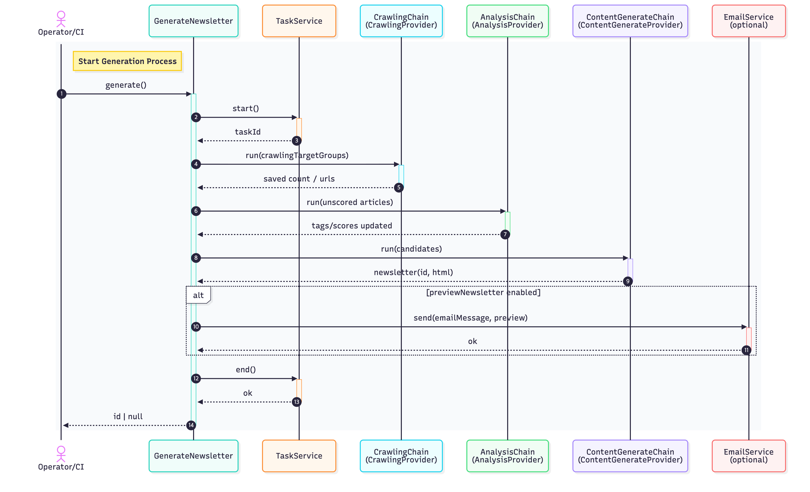

# LLM Newsletter Kit

> **Automate domain-expert newsletters powered by AI**

[
  
](https://github.com/kimhongyeon/llm-newsletter-kit-core/actions/workflows/ci.yml)
[
  
](https://www.npmjs.com/package/@llm-newsletter-kit/core)


Important: [Code of Conduct](./CODE_OF_CONDUCT.md) • [Security Policy](./SECURITY.md) • [Contributing](./CONTRIBUTING.md)

## What is this?

A type‑first, extensible toolkit that automates LLM‑based newsletter creation end‑to‑end. It orchestrates Crawling → Analysis → Content Generation → Save (with optional preview email), and every stage is swappable via DI‑capable Provider interfaces so you can plug in your own crawlers/LLMs/DB/logging. Built‑in operational features (retries, chain options) help control cost and improve reliability.

- Type-first design (TypeScript, ESM) with strong contracts
- Flexible dependency injection: easily swap Crawling/Analysis/ContentGenerate/Task/Logging/Email
- Operational features built-in: retries, chain options, preview email sending, etc.
- Rollup build (ESM+CJS+d.ts), Vitest 100% coverage, GitHub Actions CI included

## Project Background

This project originated from a **Korean cultural heritage newsletter service** called “Research Radar.”

It was architected by **Kim Hongyeon**, a unique **archaeologist-turned-software engineer**. Driven by a question he held for over a decade—***"Why must research be such grueling manual labor?"***—he combined his domain expertise with 10+ years of engineering experience to solve this problem.

After completing an academic research project on [A Study on Archaeological Informatization Using Large Language Models (LLMs)](https://poc.heripo.com), a personal automation script created to keep up with academic trends evolved into a service with a high engagement rate (15% CTR) and near-zero maintenance cost.

**Real-world production metrics:**
- **LLM API cost:** $0.2-1 USD per issue with optimized model usage
- **Operational overhead:** Truly hands-off automation—runs 24/7 without human intervention; the only ongoing work is occasional code maintenance
- **Time investment:** Set it up once, let it run indefinitely; it operates while you sleep

**Kim** extracted the generic, high-performance core engine from that service to create this toolkit, allowing other developers to build their own AI-driven media pipelines without starting from scratch.

His design philosophy: **"Logic in code, reasoning in AI, connections in architecture."** This principle guides every aspect of the kit—deterministic workflows are implemented in type-safe code, intelligent analysis is delegated to LLMs, and the entire system is glued together through clean, swappable interfaces.

- **Core (This Repository):** A domain-agnostic, type-safe engine. It orchestrates the full lifecycle (Crawling → Analysis → Content Generation → Save) via DI-capable Providers.
- **Research Radar (Reference Implementation):** A real-world application built with this Core. It serves as a live demo and a "preset" for how to implement the providers.

**Quick Links**
- Research Radar (Live Service): https://heripo.com/research-radar/subscribe
- Source Code (Usage Example): https://github.com/kimhongyeon/heripo-research-radar

## Why Code-Based?

Newsletter automation generally falls into two approaches: no-code and code-based. **This kit takes the code-based approach because it produces significantly better output quality.**

**Key advantages:**
- **Advanced AI workflows**: Implement sophisticated techniques like self-reflection, chain-of-thought reasoning, and multi-step verification—impossible or prohibitively expensive in no-code platforms
- **Cost control**: Use different models per stage, cap tokens, control retries, and prevent runaway costs with granular configuration
- **Full customization**: Swap any component (crawlers, LLMs, databases, email) via Provider interfaces without vendor lock-in
- **Production-grade**: Type-safe contracts, 100% test coverage, CI/CD integration, and observability built-in

**Real-world output example:**
See the quality for yourself—an actual newsletter generated by this kit: https://heripo.com/research-radar-newsletter-example.html

**Trade-off:** Higher initial setup complexity vs. no-code. This kit mitigates it with strong types, IDE autocompletion, sensible defaults, and a complete reference implementation.

## Installation

```bash
npm i @llm-newsletter-kit/core
```

- Node.js >= 22 (CI verified with 24.x)

## Quick Start

```ts
import { GenerateNewsletter } from '@llm-newsletter-kit/core';
import type { GenerateNewsletterConfig } from '@llm-newsletter-kit/core';
import { createOpenAI } from '@ai-sdk/openai';

const openai = createOpenAI({ apiKey: process.env.OPENAI_API_KEY });

const config: GenerateNewsletterConfig<string> = {
  contentOptions: {
    outputLanguage: 'English',
    expertField: ['Technology', 'AI'],
  },
  dateService: {
    getCurrentISODateString: () => new Date().toISOString().split('T')[0],
    getDisplayDateString: () => new Date().toLocaleDateString('en-US'),
  },
  taskService: {
    start: async () => `task-${Date.now()}`,
    end: async () => {},
  },
  crawlingProvider: {
    // Define crawling targets and parsing logic
    crawlingTargetGroups: [/* ... */],
    fetchExistingArticlesByUrls: async (urls) => [/* ... */],
    saveCrawledArticles: async (articles, context) => articles.length,
  },
  analysisProvider: {
    // Configure LLM models for analysis
    classifyTagOptions: { model: openai('gpt-5-mini') },
    analyzeImagesOptions: { model: openai('gpt-5.1') },
    determineScoreOptions: { model: openai('gpt-5.1') },
    fetchUnscoredArticles: async () => [/* ... */],
    fetchTags: async () => [/* ... */],
    update: async (article) => {},
  },
  contentGenerateProvider: {
    // Configure content generation
    model: openai('gpt-5.1'),
    issueOrder: 1,
    newsletterBrandName: 'Tech Insight Weekly',
    publicationCriteria: { minimumArticleCountForIssue: 5 },
    fetchArticleCandidates: async () => [/* ... */],
    htmlTemplate: ({ content }) => `<html>...</html>`,
    saveNewsletter: async ({ newsletter }) => ({ id: 1 }),
  },
};

const generator = new GenerateNewsletter(config);
const newsletterId = await generator.generate();
```

**⚠️ This is a minimal example showing the structure. For a complete, production-ready implementation with:**
- Real database integration (Prisma/Drizzle)
- Actual crawling targets and parsing logic
- HTML email templates
- Preview email configuration

👉 **See the reference implementation: https://github.com/kimhongyeon/heripo-research-radar**

## Public API Overview

Entry point: `src/index.ts`

- Class
  - GenerateNewsletter<TaskId>
    - constructor(config: GenerateNewsletterConfig<TaskId>)
    - generate(): Promise<string | number | null>
- Main Types
  - TaskService<TaskId> { start(): Promise<TaskId>; end(): Promise<void> }
  - CrawlingProvider { crawlingTargetGroups, fetchExistingArticlesByUrls, saveCrawledArticles, ... }
  - AnalysisProvider { classifyTagOptions.model, analyzeImagesOptions.model, determineScoreOptions(model, minimumImportanceScoreRules), fetchUnscoredArticles, fetchTags, update }
  - ContentGenerateProvider { model and generation options, issueOrder, publicationCriteria, subscribePageUrl, newsletterBrandName, fetchArticleCandidates, htmlTemplate, saveNewsletter }
  - GenerateNewsletterOptions { logger, llm, chain, previewNewsletter(emailService/emailMessage/fetchNewsletterForPreview) }
  - Domain models: DateService, EmailService, Newsletter, etc.

For detailed field descriptions, see `src/generate-newsletter/models/interfaces.ts` and type definitions under `src/models/*`.

## Architecture & Flow

1) CrawlingChain: Collect/parse/save articles from targets
2) AnalysisChain: Tagging/image analysis/importance scoring and update
3) ContentGenerateChain: Select candidates → generate Markdown via LLM → apply template (HTML) → save → return id
4) If previewNewsletter option is present, send a preview email

All chains are composed as a single pipeline using `@langchain/core/runnables` sequence.



## Crawling & Parsing Philosophy: "Bring Your Own Scraper"

This kit prioritizes flexibility over rigid tooling. Instead of locking you into a specific scraper (like Puppeteer, Playwright, or Cheerio), we define a strict interface for the pipeline. **We handle the flow; you handle the logic.**

- **Total Freedom:** You can use lightweight HTTP requests for static sites or full headless browsers for complex SPAs. As long as you satisfy the `CrawlingProvider` interface, anything works.
- **Asynchronous Injection:** Parsing logic is injected asynchronously, allowing you to integrate third-party APIs or AI-based parsers effortlessly.
- **Recommendation:** While the kit supports LLM-based parsing (HTML-to-JSON), we generally recommend **rule-based parsing** (e.g., CSS selectors) for production environments to ensure speed, cost-efficiency, and stability.

## Development / Build / Test / CI

For the full developer guide (environment, scripts, testing/coverage, and CI), see [CONTRIBUTING.md](./CONTRIBUTING.md).

## Contributing & Policies

Please refer to [CONTRIBUTING.md](./CONTRIBUTING.md) for all contribution guidelines and project policies, including:
- Issue labels and triage
- Branch strategy and PR process
- Versioning and release policy
- CI workflow and coverage requirements

## Citation & Attribution

If you use this project in your research, service, or derivative works, please include the following attribution:

```
Powered by LLM Newsletter Kit
```

This acknowledgment helps support the open source project and gives credit to its contributors.

### BibTeX Citation

For academic papers or research documentation, you may use the following BibTeX entry:

```bibtex
@software{llm_newsletter_kit,
  author = {Kim, Hongyeon},
  title = {LLM Newsletter Kit: Type-First Extensible Toolkit for Automating LLM-Based Newsletter Creation},
  year = {2025},
  url = {https://github.com/kimhongyeon/llm-newsletter-kit-core},
  note = {Apache License 2.0}
}
```

## License

Apache-2.0 © 2025-present kimhongyeon. See LICENSE and NOTICE for details.